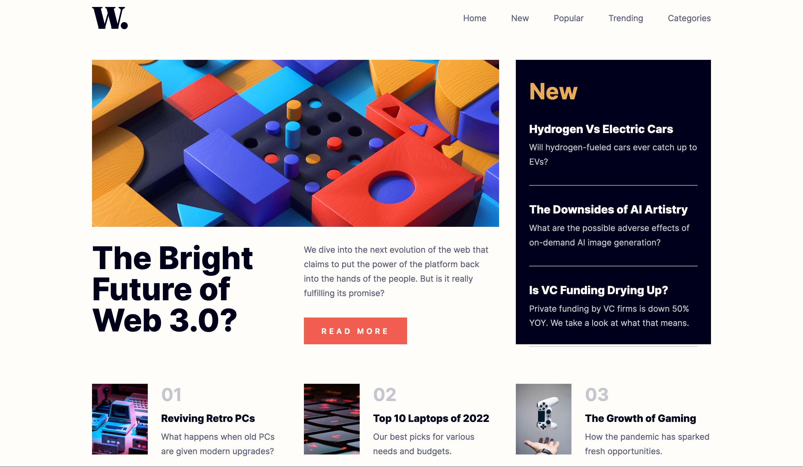
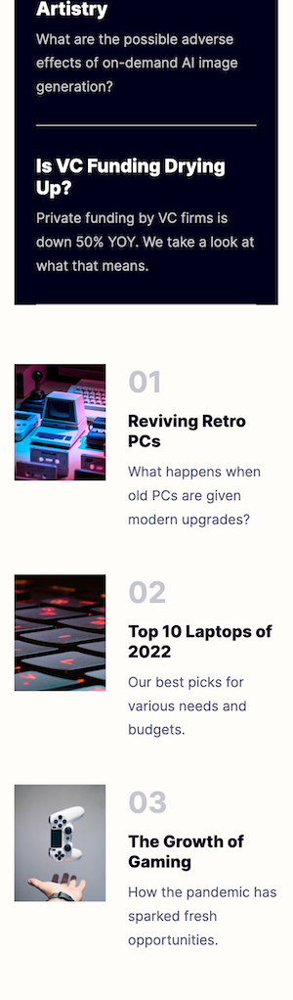

# Frontend Mentor - News homepage solution

This is a solution to the [News homepage challenge on Frontend Mentor](https://www.frontendmentor.io/challenges/news-homepage-H6SWTa1MFl). Frontend Mentor challenges help you improve your coding skills by building realistic projects. 

&nbsp;  
## Table of contents

- [Overview](#overview)
  - [The challenge](#the-challenge)
  - [Screenshot](#screenshot)
  - [Links](#links)
- [My process](#my-process)
  - [Built with](#built-with)
  - [What I learned](#what-i-learned)
  - [Continued development](#continued-development)
- [Author](#author)

&nbsp;  
## Overview

### The challenge

Users should be able to:

- View the optimal layout for the interface depending on their device's screen size
- See hover and focus states for all interactive elements on the page

&nbsp;  
### Screenshot

 

&nbsp;  
### Links

- Solution URL: (https://github.com/JakeHand/news-homepage)
- Live Site URL: (https://jakehand.github.io/news-homepage/)

&nbsp;  
## My process

### Built with

- Semantic HTML5 markup
- CSS custom properties
- Flexbox
- CSS Grid
- Javascript DOM manipulation

&nbsp;  
### What I learned

This was my first project properly using CSS grid and it was amazing. It saved me so much time in just being able to setup the page properly right from the get go.

&nbsp;  
### Continued development

Switching from desktop view to mobile view and vice versa keeps tripping me up a bit, so I am keen to continue practicing that.

&nbsp;  
## Author

I am looking for a remote internship / junior front end developer position. Contact me via email below.

- Email - jakehandp@gmail.com
- GitHub - [@JakeHand](https://github.com/JakeHand)
- Frontend Mentor - [@JakeHand](https://www.frontendmentor.io/profile/@JakeHand)